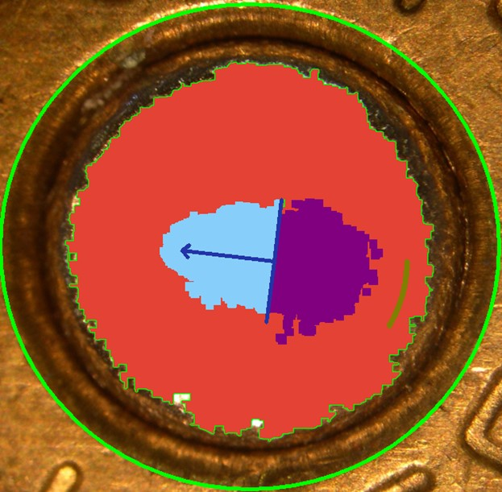

# smart-cartridge-masking-dynamic-analysis
"Smart Cartridge Masking: Dynamic Analysis" revolutionizes forensic ballistics with my custom algorithm. This computer vision project automates the identification and analysis of key features in fired bullet cartridges, including breach face impressions, firing pin marks and aperture shears enhancing the speed and accuracy of criminal investigations.

## Table of Contents

- [Introduction](#introduction)
- [Project Overview](#project-overview)
- [Technical Requirements](#technical-requirements)
- [Features](#features)
  - [Image Processing Techniques](#image-processing-techniques)
  - [Algorithm Highlights](#algorithm-highlights)
- [Getting Started](#getting-started)
  - [Prerequisites](#prerequisites)
  - [Installation](#installation)
- [Usage](#usage)
  - [Running the Analysis](#running-the-analysis)
  - [Interpreting Results](#interpreting-results)
- [Contributing](#contributing)
- [License](#license)
- [Acknowledgments](#acknowledgments)

## Introduction
In this project, I delve into the intricate world of forensic analysis, focusing on the automated and dynamic analysis of fired bullet cartridges. In this project, I have used various image masking and analysis technique which is required for forensic investigations, particularly in establishing connections between firearms and criminal activities. By examining the unique imprints left on fired bullet cartridge cases, such as breach face impressions and firing pin marks, we can draw comparisons to ascertain whether different cartridges were discharged from the same firearm.

Leveraging my expertise in computer vision and algorithm development, I developed a sophisticated algorithm capable of dynamically identifying key features on fired bullet cartridges from high-resolution images. These features are as follow:
- **Firing Pin Direction**: Denoted by Perpendicular Line on Mask Image
- **Breech Impression**: Filled with Red Color
- **Apertuer Arc**: Masked by Olive Green Arc
- **Firing Pin Drag**: Left halve of Perpendicular line



## Project Overview
This project analyse the high-resolution image of fired bullet cartrdige and automate the process of masking to overcome the manual inspection and comparison, which is often time consuming and susceptible to human-error. 

Using Computer Vision Technique, Image Processing and Geometric Computation, it can improve the efficiency and accuracy of image analysis.

Key Feature of Project Include:
- **Dynamic Feature Identification**: The algorithm automatically detects key feature listed above.
- **Advanced Image Processing Techniques**: Utilizing a suite of image processing techniques such as:
    - `Grayscale Conversion*`
    - `Edge Detection using Canny-Edge Algorithms`
    - `Hough Circle Detection`
    - `Flood-Fill`
    - `Image Masking`
    - `Contour Detection`
    - `Geometry Concept`

- **Automated Masking and Analsis**: The algorithm automatically detects key feature listed above.

## Technical Requirements
For optimal performance with the "Smart Cartridge Masking: Dynamic Analysis" project, ensure your setup meets the following specifications:

Software and Libraries: 
```bash command: !pip install -r requirement.txt``` to install the required packages for requirements.txt

- Python 3.8+: Core programming language.
- SciPy (Optional): For advanced mathematical computations.

- [numpy](www.numpy.org) is the fundamental package for scientific computing with Python.
- [matplotlib](http://matplotlib.org) is a famous library to plot graphs in Python.
- [opencv (cv2)](https://docs.opencv.org/4.x/) Library for working with image and carrying out various image/video processing algorithms
- [imutils](https://pypi.org/project/imutils/)
    - [imutils latest docs](https://imutils.readthedocs.io/en/latest/) A series of convenience functions to make basic image processing functions such as translation, rotation, resizing, skeletonization, displaying Matplotlib images, sorting contours, detecting edges

## Features

### Image Processing Techniques
In the project, I have used various Image Processing Technqiues, I will cover the basic overview to understand in simple term what does it do.

- `Grayscale Conversion:` Simplifies the image data by converting RGB images to grayscale, reducing complexity while retaining essential structural details necessary for further analysis.
- `Hough Circle Detection:` Utilizes the Hough Circle Transform to identify circular patterns, crucial for pinpointing the breach face impression on the cartridge case.
- `Canny Edge Detection:` Employs the Canny algorithm enhanced with dilation and erosion processes, sharpening the detection of edges. This step is pivotal in outlining the firing pin and other key features.

*Dilation and erosion are morphological operations used in image processing to manipulate the shape and structure of objects within an image.*

- `Dilation`: Dilation adds pixels to the boundaries of objects in an image, effectively enlarging the objects. This operation is useful for joining small breaks in an image, filling small holes, and expanding shapes.
- `Erosion`: It removes pixels on object boundaries, essentially shrinking the objects. This operation is beneficial for removing small noise, separating objects that are touching, and eroding the edges of objects.


- `Contour Detection and Analysis:` Through advanced contour detection algorithms, I identifid and isolated significant contours, including the largest ones that often correspond to the breach face impression and the firing pin.
- `Dynamic Masking and Flood Fill:` Innovatively applies masks to specific regions of interest on the cartridge case, employing a flood fill technique to highlight these areas for detailed examination.

## Algorithms Highlights
The