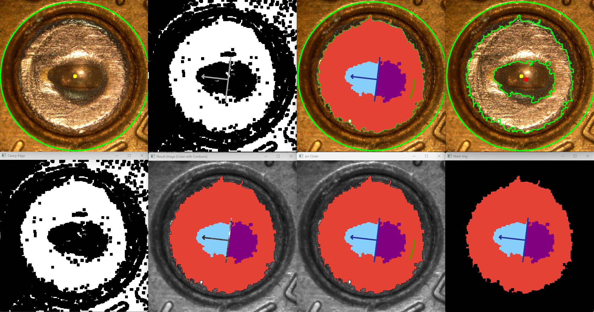
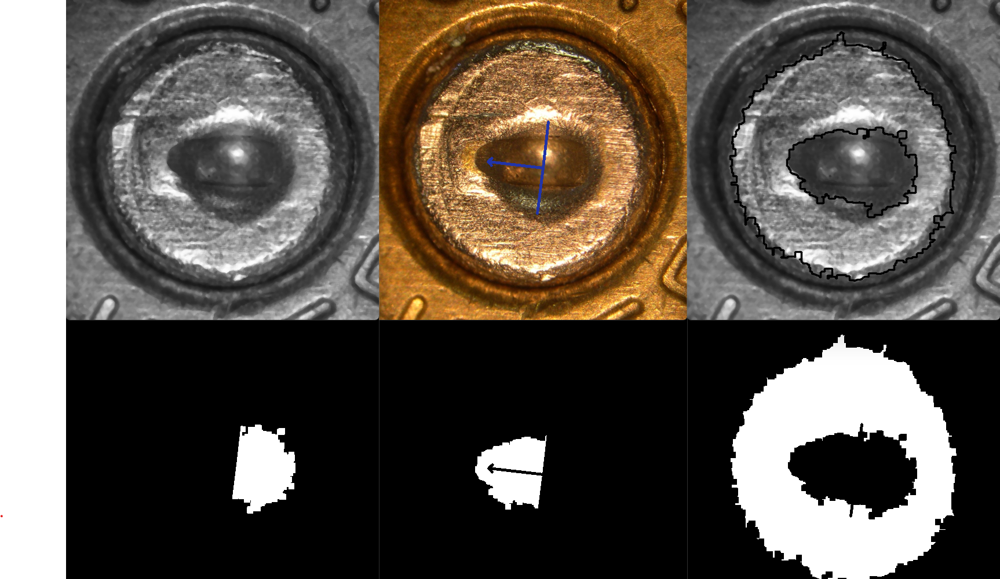

# smart-cartridge-masking-dynamic-analysis
"Smart Cartridge Masking: Dynamic Analysis" revolutionizes forensic ballistics with my custom algorithm. This computer vision project automates the identification and analysis of key features in fired bullet cartridges, including breach face impressions, firing pin marks and aperture shears enhancing the speed and accuracy of criminal investigations.

# All Image Results





## Table of Contents

- [Introduction](#introduction)
- [Project Overview](#project-overview)
- [Technical Requirements](#technical-requirements)
- [Features](#features)
  - [Image Processing Techniques](#image-processing-techniques)
  - [Algorithm Highlights](#algorithm-highlights)
- [Usage](#usage)
  - [Running the Analysis](#running-the-analysis)
  - [Interpreting Results](#interpreting-results)
- [License](#license)
- [Acknowledgments](#acknowledgments)

## Introduction
In this project, I delve into the intricate world of forensic analysis, focusing on the automated and dynamic analysis of fired bullet cartridges. In this project, I have used various image masking and analysis technique which is required for forensic investigations, particularly in establishing connections between firearms and criminal activities. By examining the unique imprints left on fired bullet cartridge cases, such as breach face impressions and firing pin marks, we can draw comparisons to ascertain whether different cartridges were discharged from the same firearm.

Leveraging my expertise in computer vision and algorithm development, I developed a sophisticated algorithm capable of dynamically identifying key features on fired bullet cartridges from high-resolution images. These features are as follow:
- **Firing Pin Direction**: Denoted by Perpendicular Line on Mask Image
- **Breach Impression**: Filled with Red Color
- **Apertuer Arc**: Masked by Olive Green Arc
- **Firing Pin Drag**: Left halve of Perpendicular line


## Project Overview
This project analyse the high-resolution image of fired bullet cartrdige and automate the process of masking to overcome the manual inspection and comparison, which is often time consuming and susceptible to human-error. 

Using Computer Vision Technique, Image Processing and Geometric Computation, it can improve the efficiency and accuracy of image analysis.

Key Feature of Project Include:
- **Dynamic Feature Identification**: The algorithm automatically detects key feature listed above.
- **Advanced Image Processing Techniques**: Utilizing a suite of image processing techniques such as:
    - `Grayscale Conversion*` [Gray-Image](./data/Gray_Scale_Image.png)

    - `Edge Detection using Canny-Edge Algorithms` [Canny-Edge](./data/CannyEdge_Detection.png)
    
    - `Hough Circle Detection` [HoughCircle-Image](./data/hough_circle_image.png)
    
    - `Contour Detection` [Contour-Detected-Image](./data/allcontours.png)
    
    - `Centroid of pin` [Centroid-of-pin-red](./data/CentroidPoint_Pin.png)

    - `Geometry Concept` [Geometry-Concept](./data/PinDirection.png)
    
    - `Image Masking` [Mask-Image](./data/outer_mask.png)
    
    - `Flood-Fill` [Flood-Fill](./data/flood_fill_image.png)

- **Automated Masking and Analsis**: The algorithm automatically detects key feature listed above.

## Technical Requirements
For optimal performance with the "Smart Cartridge Masking: Dynamic Analysis" project, ensure your setup meets the following specifications:

Software and Libraries: 
```bash command: !pip install -r requirement.txt``` to install the required packages for requirements.txt

- Python 3.8+: Core programming language.
- SciPy (Optional): For advanced mathematical computations.

- [numpy](www.numpy.org) is the fundamental package for scientific computing with Python.
- [matplotlib](http://matplotlib.org) is a famous library to plot graphs in Python.
- [opencv (cv2)](https://docs.opencv.org/4.x/) Library for working with image and carrying out various image/video processing algorithms
- [imutils](https://pypi.org/project/imutils/)
    - [imutils latest docs](https://imutils.readthedocs.io/en/latest/) A series of convenience functions to make basic image processing functions such as translation, rotation, resizing, skeletonization, displaying Matplotlib images, sorting contours, detecting edges

## Features

### Image Processing Techniques
In the project, I have used various Image Processing Technqiues, I will cover the basic overview to understand in simple term what does it do.

- `Grayscale Conversion:` Simplifies the image data by converting RGB images to grayscale, reducing complexity while retaining essential structural details necessary for further analysis.
- `Hough Circle Detection:` Utilizes the Hough Circle Transform to identify circular patterns, crucial for pinpointing the breach face impression on the cartridge case.
- `Canny Edge Detection:` Employs the Canny algorithm enhanced with dilation and erosion processes, sharpening the detection of edges. This step is pivotal in outlining the firing pin and other key features.

*Dilation and erosion are morphological operations used in image processing to manipulate the shape and structure of objects within an image.*

- `Dilation`: Dilation adds pixels to the boundaries of objects in an image, effectively enlarging the objects. This operation is useful for joining small breaks in an image, filling small holes, and expanding shapes.
- `Erosion`: It removes pixels on object boundaries, essentially shrinking the objects. This operation is beneficial for removing small noise, separating objects that are touching, and eroding the edges of objects.


- `Contour Detection and Analysis:` Through advanced contour detection algorithms, I identifid and isolated significant contours, including the largest ones that often correspond to the breach face impression and the firing pin.
- `Dynamic Masking and Flood Fill:` Innovatively applies masks to specific regions of interest on the cartridge case, employing a flood fill technique to highlight these areas for detailed examination.

## Algorithm Highlights
The algorithm developed, meticulously detects contours within the cartridge. The Contours prioritize the two most significant contours i.e `Breach Impression` and `Firing Pin`. This contours are selected based on a sophisticated analysis, which sort all detected contours by their area. To enhance the accuracy, the algorithms integrates the Hough Circle Detected. This method aids in accurately delineating the breach impression by identifying circular patterns, marked by smooth green circles in our analyses, with the center of these circles (indicated by a yellow dot) serving as a crucial reference point. -  [`Reference Image`](./data/CentroidPoint_Pin.png)

At the core, the algorithm dynamically calculate the centroid of firing pin contours, crucial for distinguishing between `Firing Pin` and `Impression Region`

Using `advanced geometric calculations`, it accurately pinpoints the tip points and divides the firing pin region, greatly improving the precision of the analysis. [Geometry-calculation](./data/PinDirection.png)

Leveraging data from contour detection and geometric analysis, the algorithm automatically creates masks for specified regions. This feature is key to isolating distinct features on the cartridge, allowing for an in-depth review of each segment. Masking aids forensic experts in visually identifying various ballistic imprints, making the comparison process more efficient. The developed algorithm marks a major leap forward in forensic ballistics, providing unprecedented automation, accuracy, and analytical detail.
`Masked Image`

[Left-Mask](./data/left_mask.png): Targets the area indicating firing pin direction, emphasizing the trajectory and impact direction.

[Right-Mask](./data/right_mask.png): Focuses on the firing pin impression, showcasing the direct contact points.

[Outer-Mask](./data/outer_mask.png): Encompasses the breach face impression, outlining the interface between the cartridge and the firearm's breach.

Following the establishment of these targeted mask regions, the cv2 library's flood fill method was employed to populate these masks with color, enhancing visibility and differentiation among the various forensic markers. Subsequently, these color-filled masks were superimposed onto both the grayscale and the original images of the cartridges. This step was crucial for achieving a comprehensive visual representation of the masked areas, offering a clear and detailed view of the significant forensic features.

# All Image Results


# Usage
## Running the Analysis

To conduct the analysis with the "Smart Cartridge Masking: Dynamic Analysis" algorithm, follow these steps:

1. **Prepare Your Image**: Ensure the cartridge image is high-resolution for optimal results. Load the image into the system where the algorithm is deployed.
2. **Execute the Algorithm**: Run the algorithm script. It automatically processes the image through several stages—grayscale conversion, Hough Circle detection, Canny edge detection, and contour identification.
3. **Review Masked Output**: The algorithm applies masks to the identified regions of interest—firing pin drag, firing pin impression, and breach face impression—highlighting these areas on the cartridge image for analysis.

## Interpreting Results

- **Examine Masked Regions**: Look at the color-filled masks applied to the cartridge image. Each mask indicates a specific forensic feature critical for analysis.
- **Analyze Forensic Features**: Use the masked outputs to examine the breach impression, firing pin drag, and firing pin impression. These features are crucial for linking the cartridge to a specific firearm.
- **Consider Algorithm Accuracy**: Remember, the precision of feature identification may vary based on the image resolution. High-resolution images yield more accurate results, while lower resolution images may require more careful interpretation.
- **Leverage AI for Enhanced Analysis**: For further automation and improved accuracy, consider using AI models like CNN or YOLO, which can learn from labeled images to enhance the masking process and forensic analysis.

By following these guidelines, users can effectively run the analysis and interpret the results, leveraging the algorithm's capabilities to aid in forensic investigations.

# License

This project is licensed under the GNU General Public License v3.0 - see the [LICENSE](/LICENSE) file for details. This license allows you to modify, distribute, and contribute to this software, as long as the modifications are also made available under the same GNU license, ensuring freedom for all users.

# Acknowledgments

A special thanks to the following:

- **OpenCV Community**: For their invaluable resources and support in the development of image processing techniques.
- **Computer Vision Researchers and Developers**: For paving the way with innovative algorithms and methodologies that inspire projects like mine.
- **You**: Yes, you reading this! Your interest and potential contribution to this project are what keep it growing and improving.

Finally, my gratitude extends to all those who have contributed to the field of computer vision and forensic analysis, providing the tools and knowledge necessary to embark on such a project.
